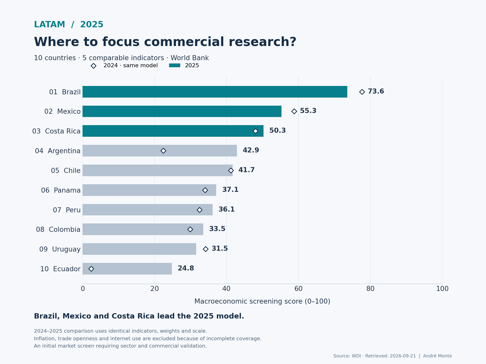
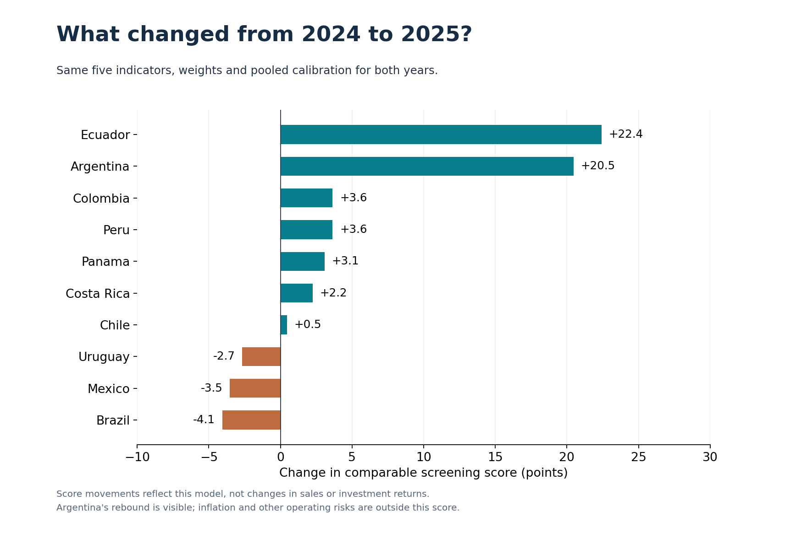

# LATAM Market Expansion Intelligence — 2025 update

Macroeconomic screening of ten Latin American markets, with a like-for-like 2024 comparison.

**Reference year: 2025 · Source retrieved: 2026-09-21 · Analysis updated: 2026-09-30**



## Business question

Which markets should enter the first stage of commercial expansion research, based on comparable public data?

## What the updated model says

**Brazil, Mexico and Costa Rica lead the five-indicator 2025 screening.** They also occupy the top three places in the comparable five-indicator 2024 baseline. The original eight-indicator 2024 model remains available as a historical view.

| Rank 2025 | Market | Score 2025 | Comparable score 2024 | Change (pts) | Top-3 scenario share |
|---:|---|---:|---:|---:|---:|
| 1 | Brazil | 73.6 | 77.7 | -4.1 | 100.0% |
| 2 | Mexico | 55.3 | 58.8 | -3.5 | 99.4% |
| 3 | Costa Rica | 50.3 | 48.1 | +2.2 | 97.2% |
| 4 | Argentina | 42.9 | 22.4 | +20.5 | 3.2% |
| 5 | Chile | 41.7 | 41.2 | +0.5 | 0.1% |
| 6 | Panama | 37.1 | 34.0 | +3.1 | 0.0% |
| 7 | Peru | 36.1 | 32.5 | +3.6 | 0.0% |
| 8 | Colombia | 33.5 | 29.9 | +3.6 | 0.0% |
| 9 | Uruguay | 31.5 | 34.2 | -2.7 | 0.0% |
| 10 | Ecuador | 24.8 | 2.4 | +22.4 | 0.0% |

Top-3 scenario share is the proportion of 2,000 alternative weight combinations that put a country in the top three. It is **not** the probability of business success.

## Why this update uses five indicators

The eight-series source extract contains 68 of the 80 possible observations for 2025. Five indicators have full coverage for every country in both 2024 and 2025:

| Indicator | Role | Weight |
|---|---|---:|
| GDP, current USD | Economic scale | 30.77% |
| Real GDP growth | Growth momentum | 23.08% |
| GDP per capita, current USD | Average-income proxy | 15.38% |
| Population | Population scale | 15.38% |
| FDI net inflows / GDP | Foreign-capital flows | 15.38% |

Weights are the original weights renormalized from a retained total of 65%; rounding accounts for any displayed sum discrepancy. No country is scored with a different set of variables. No gaps are filled with earlier-year values.

| Indicator | 2025 coverage | Core model | Missing country codes |
|---|---:|---|---|
| gdp_usd | 10/10 | Included | None |
| gdp_growth_pct | 10/10 | Included | None |
| gdp_per_capita_usd | 10/10 | Included | None |
| population | 10/10 | Included | None |
| internet_users_pct | 0/10 | Excluded uniformly | ARG;BRA;CHL;COL;CRI;ECU;MEX;PAN;PER;URY |
| trade_pct_gdp | 9/10 | Excluded uniformly | PAN |
| fdi_net_inflows_pct_gdp | 10/10 | Included | None |
| inflation_pct | 9/10 | Excluded uniformly | ARG |

Inflation, trade openness and internet use remain in the source data and coverage audit. They are excluded from **both** years of the comparable score. Accordingly, this version is a narrower macroeconomic screen, and it does not measure commercial accessibility or price stability.

## A fair comparison across years

Both years use the same five indicators, weights and normalization bounds. The bounds are the 5th and 95th percentiles of the pooled 20 country-year observations (10 markets × 2 years). Values are clipped to those bounds and scaled to 0–100.



The five-indicator 2024 score was recalculated for this comparison. **Do not compare the new 2025 scores directly with the original eight-indicator 2024 scores.** Differences between those models also reflect the indicator selection, weights and normalization.

## Commercial interpretation

- **Brazil** leads in this model, with economic and population scale contributing strongly.
- **Mexico** remains second, while its comparable score declines; the recorded real GDP growth rate falls from 1.35% in 2024 to 0.56% in 2025.
- **Costa Rica** remains third under the common five-indicator specification; growth and FDI relative to GDP support its position.
- **Argentina** moves from ninth to fourth in the comparable model as recorded GDP growth rebounds from -1.34% to 4.37%. Inflation is excluded from this score, so the improvement is not a conclusion about operating risk.

These are prompts for sector and customer research, not a market-entry recommendation.

## Reproduce

Python 3.11+ is required by the pinned NumPy version. Validated with Python 3.12.

```bash
python -m venv .venv
# macOS / Linux:
source .venv/bin/activate
# Windows PowerShell: .venv\Scripts\Activate.ps1
python -m pip install -r requirements.txt

# Offline: use the committed, checksummed source snapshot
python src/build_analysis.py
python -m unittest discover tests -v

# Optional: explicitly download a new official source snapshot
python src/build_analysis.py --refresh
```

The default build never changes the source retrieval date. The source manifest stores the acquisition date, source URL and CSV checksum for each series. This release uses the previously committed source snapshot from 21 September 2026. A fresh batch download attempted on 30 September timed out, so it did not replace that snapshot. The public WDI release listing was checked on 30 September and still listed the 13 July 2026 update. A successful future refresh also archives the raw JSON responses and exact acquisition timestamps.

The release is fixed to 2024–2025. A later reference year requires an explicit methodology update and coverage check.

## Files to explore

- [Executive summary](reports/executive_summary.md)
- [Method, weights and data dictionary](docs/data_dictionary.md)
- [2025 ranking](data/processed/market_screening_2025.csv)
- [Comparable 2024–2025 results](data/processed/market_screening_comparison_2024_2025.csv)
- [Coverage audit](data/processed/data_coverage_2024_2025.csv)
- [Source manifest](data/raw/source_manifest.json)
- [Review notebook](notebooks/executive_analysis.ipynb)
- [Spanish LinkedIn image](reports/figures/linkedin_2025_es.png)
- [Spanish LinkedIn text and publishing steps](docs/linkedin_post_es.md)
- [Historical eight-indicator model](reports/historical_2024.md)

## Limits

This is a relative screening model for the ten selected countries. It excludes sector demand, competition, regulation, taxes, security, route-to-market costs and product-market fit. The current score also excludes inflation, trade openness and digital reach. GDP and population overlap as scale proxies; these weights reflect a strategy choice. GDP and GDP per capita in current USD are affected by exchange rates and prices, and should not be read as real growth or purchasing-power parity.

Published WDI observations can contain official estimates and may be revised. This project adds no invented data, forecasts or missing-value imputations. The sensitivity analysis varies weights within the chosen model; it does not test all possible indicator sets or quantify statistical confidence. Pooled scaling is for retrospective comparison, not an out-of-sample forecast.

## Source

[World Bank — WDI API](https://datahelpdesk.worldbank.org/knowledgebase/articles/889392-about-the-indicators-api-documentation).
Source retrieved: **2026-09-21**. API-reported dataset update: **2026-07-13**.
[Official July 2026 release note](https://datatopics.worldbank.org/world-development-indicators/release-note/jul-2026.html) confirms publication of 2025 national-accounts and population data.

Code: MIT license. World Bank source data remain subject to their [dataset terms](https://datacatalog.worldbank.org/search/dataset/0037712/world-development-indicators).

## Author

André Luiz Monte — Commercial Leadership · Business Development · Data Analytics
