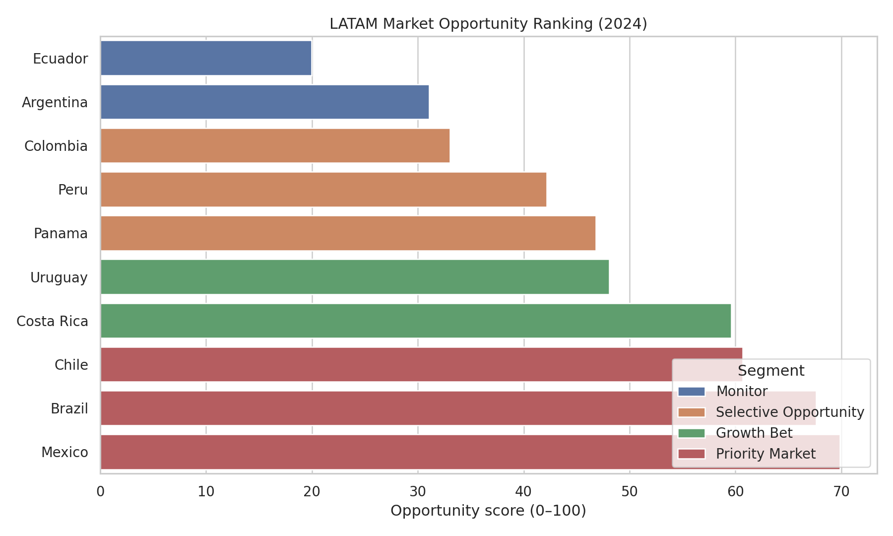
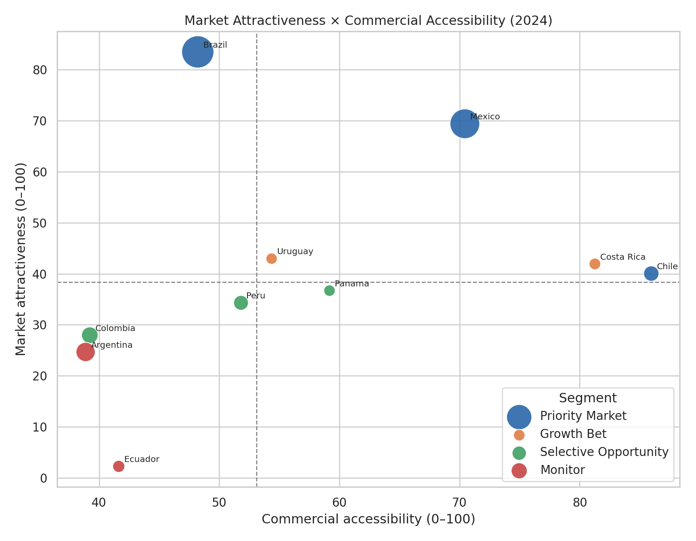

# Historical reference — 2024 eight-indicator model

This is the original model specification, retained for transparency. It uses eight indicators and year-specific 2024 normalization. It is **not directly comparable** to the five-indicator 2025 model or its recalculated 2024 baseline.

| Rank | Country | Original model score |
|---:|---|---:|
| 1 | Mexico | 69.9 |
| 2 | Brazil | 67.6 |
| 3 | Chile | 60.7 |
| 4 | Costa Rica | 59.6 |
| 5 | Uruguay | 48.1 |
| 6 | Panama | 46.8 |
| 7 | Peru | 42.2 |
| 8 | Colombia | 33.0 |
| 9 | Argentina | 31.1 |
| 10 | Ecuador | 20.0 |

The historical outputs remain at [market_opportunity_ranking.csv](../data/processed/market_opportunity_ranking.csv) and [weight_sensitivity.csv](../data/processed/weight_sensitivity.csv). In the historical schema, top3_probability means the share of weight scenarios, not probability of commercial success.

The current source snapshot may revise historical values. The original September 2026 release is also preserved in Git history.
